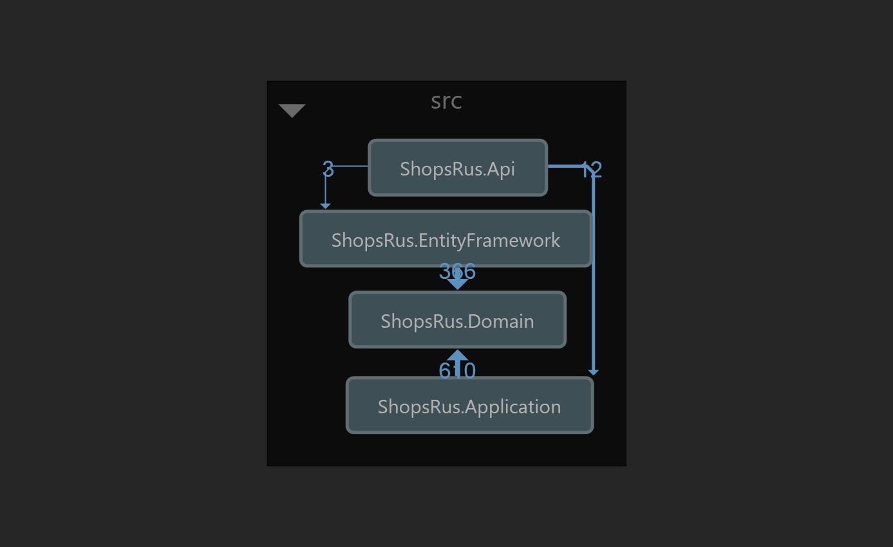
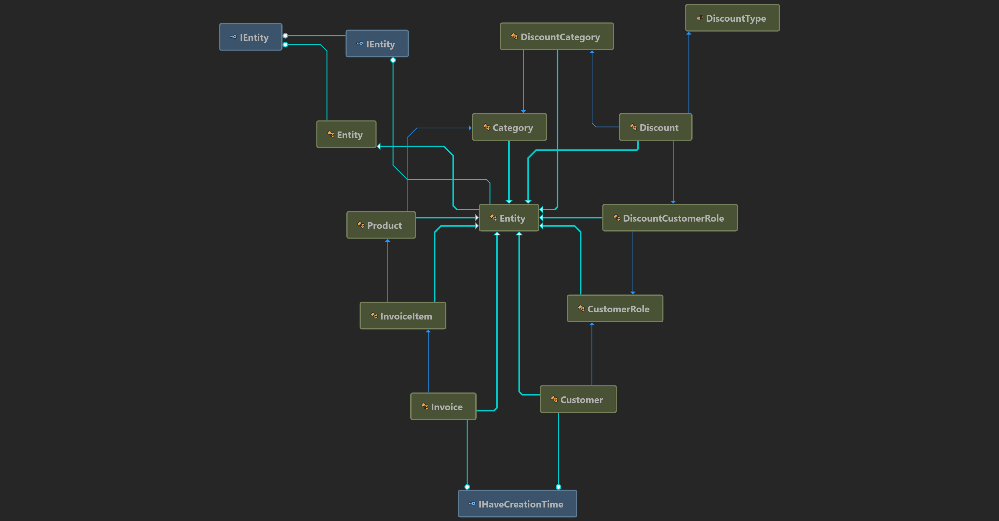

# ShopsRus Project
The ShopsRus project is provide a Web API that generate the total cost and invoices for customers based on give criteria (e.g. Customer Role, Customer Creation, and invoice sub totla).

## ShopsRus Solution
In this solution you will find 4 projects under src folder which are the source code for the project. 
And under tests folder you will find the test project for the solution, now we only have one test project to test the Application project.



## ShopsRus.Domain Project
This is the domain layer of the solution. It contains entities and repository interfaces.

## ShopsRus.Application Project
This project contains the application service implementation.

## ShopsRus.EntityFramework Project
This is the integration project for the EF Core. It defines the DbContext and implements repository interfaces defined in the ShopsRus.Domain project.

## ShopsRus.Api Project
This is the Web API project that contains the controllers and endpoints.

## Core entities architecture




# How the discount is working
We have created a dynmic structure to handle the discounts based on the company requirements. 
Where we defined three different types of discounts: Per Customer Role, Per Customer Creation Date, and by Split the total amount of the bill.

These three types can be found under the ShopsRus.Domain project in DiscountType enum.
And for each single Discount can have its own product categories and customer roles to be included/execluded explicitly as defined in `DiscountCategory` & `DiscountCustomerRole` classes.
The fixed or the percentage discount can be defined in the Discount entity. 

This entity will be used by the `IDiscountCalculatorService` to calculate the right discount for a given order which is represented by the OrderDto class under `ShopsRus.Domain` Project.

## Run the solution
In order to run the solution you need to open it using Visual Studio 2019+, restore nugget packages and hit F5 after selecting the `ShopsRus.Api` project as a startup project.

## Run the unit test
To run the unit test go to the command line and cd to `tests\ShopsRus.Tests.Application`
run the following command: 
```sh
dotnet test
```

## Generate the test coverage report
I'm using the coverlet.console to generate the coverage report and in order to generate the report you need to install this tool first.
```sh
dotnet install tool -g coverlet.console
```
Then build the project using
```sh
dotnet build
```
and finally generate the report using the following command:
```sh
coverlet .\bin\Debug\net5.0\ShopsRus.Application.dll --target "dotnet" --targetargs "test --no-build"
```
